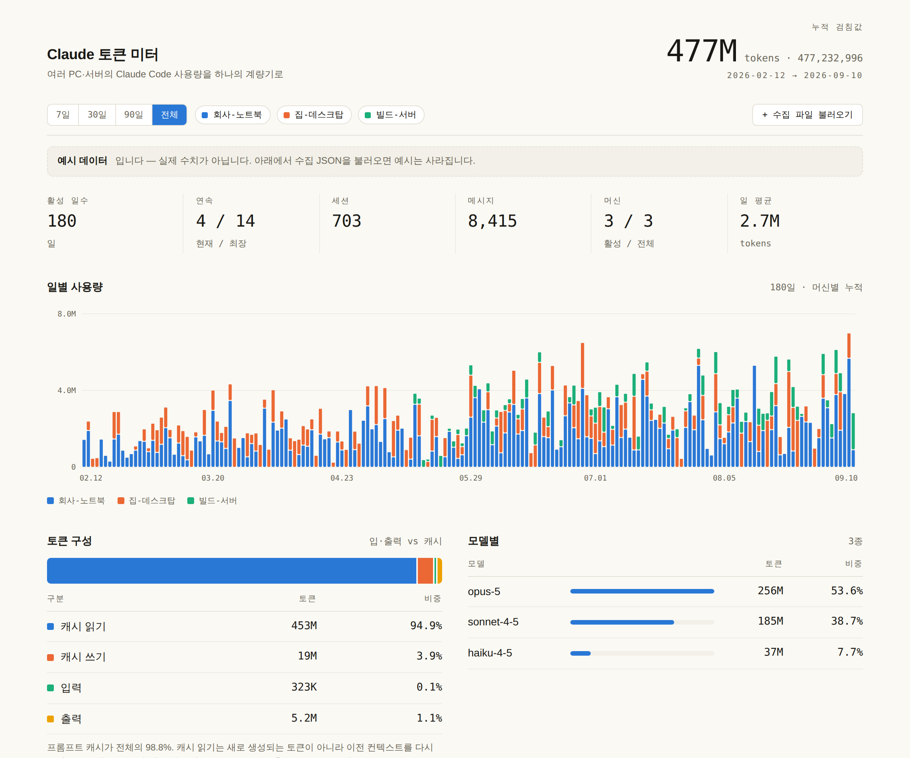

# Claude 토큰 미터

Claude Code 토큰 사용량을 여러 PC·서버에서 모아 한 화면에서 본다.
파일 하나, 표준 라이브러리만, Python 3.6 이상.

```bash
python3 claude-usage.py
```

브라우저가 열리면서 이 PC의 사용량이 바로 보인다.



*화면의 수치는 예시 데이터다. 실제로 돌리면 자기 기록으로 채워진다.*

---

## 왜 로컬 로그를 읽나

Anthropic의 [Usage and Cost Admin API](https://platform.claude.com/docs/en/manage-claude/usage-cost-api)는
**API 사용량만** 다룬다. Pro/Max 구독으로 쓰는 Claude Code 사용량은 그 API로
조회되지 않는다. 그래서 구독 사용자에게는 로컬 트랜스크립트가 사실상 유일한
소급 가능한 데이터 소스다.

Claude Code는 모든 세션을 `~/.claude/projects/<프로젝트>/<세션>.jsonl` 로 남기고,
`assistant` 항목마다 `message.usage` 에 토큰 수를 기록한다. 이 도구는 그 값을 읽는다.

**여기 숫자는 청구 기준도, 구독 한도 기준도 아니다.** 트랜스크립트를 지운 기간은
집계에 잡히지 않는다.

## 무엇이 수집되나

**대화 내용, 프롬프트, 코드, 작업 파일 경로는 읽지도 저장하지도 않는다.**
`message.usage` 의 토큰 수와 타임스탬프, 모델 이름만 본다.

다만 수집 JSON 에는 토큰 수치 말고도 다음이 들어간다.

| 항목 | 내용 |
| --- | --- |
| `machine.hostname` | 호스트명. `--machine` 으로 표시 이름을 바꿔도 이 필드는 따로 기록된다 |
| `machine.os` | OS 이름과 버전 |
| `source.root` | 트랜스크립트 디렉터리의 절대경로. **사용자 계정명이 포함된다** (`C:\Users\alice\.claude\projects`) |
| `projects` | 프로젝트 이름. 경로의 마지막 조각만 남는다 (`-home-alice-work-myapp` → `myapp`) |
| `tz` | 로컬 타임존 |

세션은 개수만 세고 ID 는 담지 않는다.

JSON 을 공유 폴더에 올리거나 남에게 보낼 때, 대시보드 스크린샷을 공유할 때는 위
항목을 감안하라.

## 설치

`claude-usage.py` 하나만 받으면 된다. 의존성 없음.

## 한 대만 볼 때

```bash
python3 claude-usage.py              # 브라우저가 열린다
python3 claude-usage.py --daemon     # 백그라운드로 (창을 닫아도 계속)
python3 claude-usage.py --status
python3 claude-usage.py --stop
```

Windows에서는 `--daemon` 이 `pythonw.exe` 로 띄우므로 콘솔 창이 뜨지 않는다.

## 여러 대를 한 화면에

데이터가 어떤 식으로든 대시보드를 띄운 PC로 와야 한다. 상황에 맞는 것 하나만 고른다.

### A. 같은 네트워크 — 직접 전송

대시보드 PC에서 외부 수신을 연다. `--host` 는 **이 PC의 어느 네트워크로 열지**를
정하는 값이지, 상대 주소를 넣는 자리가 아니다.

```bash
python3 claude-usage.py --daemon --host 0.0.0.0
```

띄우면 다른 머신에서 쓸 명령이 그대로 출력된다. 각 머신에서:

```bash
python3 claude-usage.py --push http://192.168.0.10:8787 --machine "빌드-서버"
```

자동화는 `--install` 을 붙인다.

```bash
python3 claude-usage.py --install --push http://192.168.0.10:8787 --machine "빌드-서버"
```

- **Linux**: crontab 에 1시간 주기로 직접 등록한다.
- **macOS**: `~/Library/LaunchAgents/dev.claude-usage.plist` 를 쓰고 `launchctl load` 한다.
- **Windows**: 등록하지 않고 **실행할 `schtasks` 명령을 출력만 한다.** 출력된 줄을
  PowerShell에 붙여 넣으면 등록된다. (사용자 몰래 예약 작업을 만들지 않기 위해서다.)

`--dry-run` 을 붙이면 어느 OS에서든 등록 대신 내용만 보여준다.

아무나 보내는 게 걸리면 양쪽에 `--token <문자열>` 을 붙인다. 다르면 403.

### B. 공유 폴더 (Dropbox / OneDrive / iCloud / git)

```bash
# 각 머신에서
python3 claude-usage.py --export ~/Dropbox/claude-usage/

# 대시보드 PC에서
python3 claude-usage.py --daemon --watch ~/Dropbox/claude-usage
```

### C. 파일을 직접 끌어다 놓기

`--export` 로 만든 JSON을 대시보드 화면에 드래그하면 된다.

## 옵션

| 옵션 | 설명 |
|---|---|
| `--daemon` | 백그라운드로 띄우고 터미널을 돌려준다 |
| `--status` / `--stop` | 상태 확인 / 종료 |
| `--host 0.0.0.0` | 다른 머신이 `--push` 로 보낼 수 있게 연다 (기본은 로컬 전용) |
| `--port N` | 기본 8787 |
| `--watch DIR` | 공유 폴더를 읽어들인다 (여러 번 지정 가능) |
| `--push URL` | 이 머신 사용량을 전송하고 종료 |
| `--export PATH` | 이 머신 사용량을 JSON으로 저장하고 종료 |
| `--install` | 자동 실행 등록. 단독이면 로그온 시 대시보드, `--push`/`--export` 와 함께면 1시간마다. Windows는 명령만 출력 |
| `--dry-run` | `--install` 시 등록 대신 내용만 출력 |
| `--token STR` | `--push` 인증용 공유 비밀문자열 |
| `--machine NAME` | 표시할 이름 (기본: hostname) |
| `--claude-dir PATH` | Claude Code 홈 (기본 `~/.claude`) |
| `--since` / `--until` | `YYYY-MM-DD` 기간 제한 |
| `--pricing FILE` | 단가표를 주면 비용을 추정한다 |
| `--diag` | 데이터 규모와 스캔 시간 출력 (느릴 때 원인 확인용) |
| `--clear-cache` | 스캔 캐시 삭제 |
| `--no-browser` | 브라우저를 자동으로 열지 않는다 |

상태는 `~/.claude-usage/` 아래에 둔다 — `machines/` (받은 스냅샷),
`cache/` (증분 스캔 캐시), `server.log`.

## 증분 스캔

트랜스크립트는 뒤에만 덧붙는 파일이다. 파일마다 (크기, 수정시각, 읽은 위치,
뽑아낸 행)을 캐시해 두고 **늘어난 꼬리만** 읽는다. 아무것도 안 바뀌었으면
지문만 확인하고 건너뛴다.

137MB 기준 실측:

| | 전체 재파싱 | 증분 |
|---|---|---|
| 최초 1회 | 2.8초 | 5.4초 (캐시 생성) |
| 재시작 | 2.8초 | **0.07초** |
| 사용 중 1건 추가 | 2.8초 | 0.75초 (554바이트만 읽음) |

캐시는 프로젝트 폴더당 파일 하나다. 세션마다 만들면 수천 개가 되고, Windows에서는
Defender가 하나씩 검사해 첫 스캔이 크게 느려진다.

스캔은 **요청을 막지 않는다.** 페이지는 즉시 뜨고 스캔은 뒤에서 돈다.
동시에 하나만 돌며, 재스캔 간격은 지난 스캔 시간에 맞춰 늘어난다.

## 정확도

- **중복 제거**: 세션을 재개하거나 분기하면 같은 응답이 여러 파일에 중복 기록된다.
  `message.id` + `requestId` 로 제거한다. 없으면 과다 집계된다.
- **캐시 읽기가 총량의 90% 이상인 게 정상이다.** 새로 생성된 토큰이 아니라 이전
  컨텍스트를 다시 읽어들인 양이라, 화면에서 따로 분리해 보여준다.
- **증분 결과는 전체 재파싱과 일치한다.** 바꿀 때마다 두 경로를 비교해 확인했다.
- **날짜는 전부 UTC 기준으로 계산한다.** `new Date("...T00:00:00")` 은 로컬로
  파싱되는데 `toISOString()` 은 UTC로 되돌리므로, UTC+9 같은 곳에서는 하루를 더해도
  같은 날짜가 나와 루프가 끝나지 않는다. 서울·UTC·LA·UTC+14에서 확인했다.

## 문제 해결

**`--host 192.168.x.x` 가 "이 PC의 주소가 아닙니다" 로 거부된다**
`--host` 는 *이 PC의 어느 네트워크로 열지*를 정하는 값이지 상대 주소를 넣는
자리가 아니다. 이 PC에서만 볼 거면 생략하고, 다른 머신이 보내게 하려면
`--host 0.0.0.0`.

**`SyntaxError: future feature annotations is not defined`**
Python 3.6 미만이다. 다른 버전이 깔려 있으면 그걸로 실행한다
(`python3.8 claude-usage.py ...`).

**첫 실행이 몇 분씩 걸린다**
트랜스크립트 전체를 한 번은 읽어야 한다. `~/.claude/projects` 가 4GB면 수 분이다.
그동안 화면은 멈추지 않고 "스캔 중"이 뜨며, 끝나면 자동으로 채워진다.
**그 다음부터는 재시작해도 즉시 뜬다.** 크기는 이렇게 확인한다.

```powershell
(Get-ChildItem "$env:USERPROFILE\.claude\projects" -Recurse -File | Measure-Object Length -Sum).Sum/1MB
```

**화면이 느리거나 숫자가 이상하다**
화면 맨 아래 `계산 …ms · 그리기 …ms` 와 아래 명령의 출력을 함께 보면 원인이 갈린다.

```bash
python3 claude-usage.py --diag
```

**`--push` 가 안 닿는다**
받는 쪽이 `--host 0.0.0.0` 으로 떠 있는지, 방화벽 허용을 눌렀는지,
두 머신이 같은 서브넷인지 확인한다. 안 되면 공유 폴더 방식(B)으로 돌린다.

**포트가 이미 쓰이고 있다**
`--port 18787` 처럼 다른 번호를 준다.

## 비용 추정 (선택)

단가는 자주 바뀌고 플랜마다 달라 내장하지 않았다. 단가표를 주면 그 값으로만
계산한다. USD / 1M tokens, 모델명 부분 문자열 매칭.

```json
{
  "opus":   { "input": 0, "output": 0, "cache_write": 0, "cache_read": 0 },
  "sonnet": { "input": 0, "output": 0, "cache_write": 0, "cache_read": 0 },
  "haiku":  { "input": 0, "output": 0, "cache_write": 0, "cache_read": 0 }
}
```

숫자는 자리표시자다. 현재 요금표를 확인해 채워 넣을 것.

```bash
python3 claude-usage.py --pricing pricing.json --export out.json
```

## 실시간이 필요하면 — OpenTelemetry

이 도구는 "스캔한 시점의 스냅샷"이다. 분 단위 실시간이 필요하면 Claude Code의
OTel 내보내기를 쓰면 된다. 다만 과거는 소급되지 않으므로 과거는 이 도구,
앞으로는 OTel 조합이 된다.

```bash
export CLAUDE_CODE_ENABLE_TELEMETRY=1
export OTEL_METRICS_EXPORTER=otlp
export OTEL_EXPORTER_OTLP_PROTOCOL=http/protobuf
export OTEL_EXPORTER_OTLP_ENDPOINT=https://<collector>/v1/metrics
```

메트릭: `claude_code.token.usage`, `claude_code.cost.usage`,
`claude_code.session.count`, `claude_code.active_time.total`.

## 출력 JSON (schema 1)

```jsonc
{
  "schema": 1,
  "generated_at": "2026-09-10T02:00:00+00:00",
  "tz": "Asia/Seoul",
  "machine": { "id": "9f2c…", "label": "집-데스크탑", "hostname": "…", "os": "…" },
  "range":   { "first": "2026-02-11", "last": "2026-09-10" },
  "totals":  { "i":0, "o":0, "cw":0, "cr":0, "m":0, "total":0,
               "sessions":0, "active_days":0 },
  "daily":   { "2026-09-10": { "i":0,"o":0,"cw":0,"cr":0,"m":0,"s":0 } },
  "daily_models": { "2026-09-10": { "claude-opus-…": 0 } },
  "models":  { "claude-opus-…": { "i":0,"o":0,"cw":0,"cr":0,"m":0 } },
  "projects":{ "myapp": { "i":0,"o":0,"cw":0,"cr":0,"m":0,"last":"2026-09-10" } },
  "hours":   [0, …24개],
  "weekday_hour": [[…24개] ×7]
}
```

`i` 입력, `o` 출력, `cw` 캐시 쓰기, `cr` 캐시 읽기, `m` 메시지, `s` 세션.
머신 id는 hostname+플랫폼 해시라 같은 머신에서 다시 돌리면 같은 값이 나온다.

## 소스 구성

`claude-usage.py` 는 `src/` 를 합쳐 만든 배포본이다. 직접 고칠 때는 `src/` 를
고치고 다시 빌드한다.

```
src/collect.py      트랜스크립트 파싱·집계 (단독 실행도 가능)
src/server.py       대시보드 서버 + 증분 스캔 + CLI
src/dashboard.html  화면
src/merge.py        여러 JSON을 미리 합칠 때 쓰는 보조 스크립트
build.py            src/ → claude-usage.py
```

```bash
python3 build.py
```

## 라이선스

MIT
